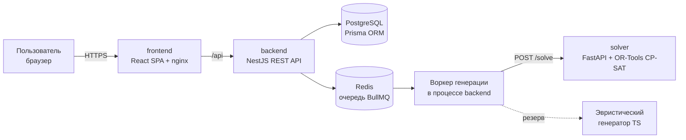
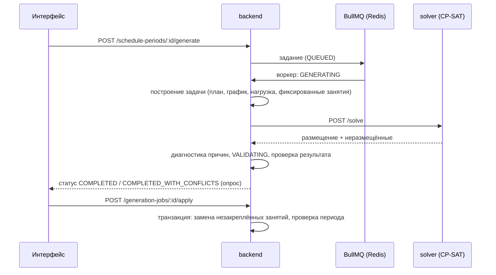

# 1. Архитектура приложения

## Компоненты



| Компонент | Технологии | Ответственность |
| --- | --- | --- |
| `apps/frontend` | React 19, TypeScript, Vite, Tailwind CSS 4, shadcn/ui (Radix), TanStack Query/Table, React Hook Form + Zod, FullCalendar, DnD Kit, Recharts | Интерфейс всех ролей, drag-and-drop правка расписания, формы с валидацией, графики |
| `apps/backend` | NestJS 11, Prisma 6, PostgreSQL 16, BullMQ + Redis, JWT (access + refresh), class-validator, Swagger, exceljs, pdfmake | REST API, бизнес-правила, проверка конфликтов, контроль часов, отчёты, экспорт, очередь генерации |
| `apps/solver` | Python 3.11, FastAPI, Google OR-Tools CP-SAT, pydantic | Оптимизация расписания: понедельная CP-SAT-модель с жёсткими и мягкими ограничениями |

## Модули backend

```
auth · users · audit · settings                 — доступ, пользователи, журнал, настройки колледжа и звонки
specialties · programs (curriculum, import)     — специальности, учебные планы, циклы, дисциплины, часы, импорт Excel
groups · teachers · classrooms · assignments    — справочники, подгруппы, доступность, педагогическая нагрузка
calendar                                        — календарный график, праздники, практики, аттестация, прогноз ёмкости
planning                                        — контекст календаря, потоки спроса, калькулятор часов (ядро расчётов)
scheduler                                       — построение задачи, клиент CP-SAT, эвристика, диагностика, задания, применение
validation                                      — проверка одного занятия (мгновенно) и всего периода
schedule                                        — периоды, занятия, переносы, отмены, замены, факт проведения, отработки
hour-control · reports · export · dashboard     — выполнение часов, 12 отчётов, Excel/PDF, сводки по ролям
notifications                                   — уведомления об изменениях и публикации
```

Слой `planning` — единый источник правды для генератора, валидатора и контроля часов:

- **CalendarContext** определяет для каждой группы и даты, разрешены ли обычные занятия, какие практики идут, какие
  блокировки действуют (каникулы, сессия, праздники, ГИА), и недоступность преподавателей по датам.
- **DemandStreams** превращает учебный план и нагрузку в «потоки спроса»: группа × дисциплина семестра × вид занятия
  × подгруппа × преподаватель, с плановыми часами и парами.
- **Калькулятор часов** сопоставляет занятия потокам и считает план, расписание, факт, остаток, дефицит, превышение и
  прогноз (см. [расчёт часов](03-hours.md)).

## Поток генерации



- Если Redis не задан, задание выполняется в процессе API (`QUEUE_MODE=inline`).
- `SOLVER_MODE=auto`: CP-SAT при доступности сервиса, иначе встроенная эвристика; `cp-sat` — только CP-SAT (с
  резервом при ошибке); `heuristic` — только эвристика.
- Результат хранится в задании (предпросмотр), применяется отдельно; ручные, закреплённые и проведённые занятия
  сохраняются.

## Роли и безопасность

| Роль | Возможности |
| --- | --- |
| Администратор | Всё, включая пользователей и настройки колледжа |
| Диспетчер (методист) | Учебные планы, справочники, нагрузка, генерация, правка и публикация расписания, отметки, отработки, отчёты |
| Преподаватель | Своё опубликованное расписание, отметка своих занятий, своя нагрузка и отчёт по своему расписанию |
| Студент | Опубликованное расписание своей группы, изменения, уведомления |
| Руководитель | Просмотр расписания, контроля часов, нагрузки, отчётов и аналитики без права изменения |

- JWT: короткоживущий access-токен и refresh-токен (хранится в БД в виде SHA-256-хеша, ротация при обновлении).
- Глобальные guards: аутентификация (`@Public()` для открытых методов) и проверка ролей (`@Roles()`), плюс проверки
  владения в сервисах (преподаватель — только свои занятия, студент — только своя группа, неопубликованные периоды
  скрыты от преподавателей и студентов).
- Валидация DTO (class-validator) с сообщениями на русском языке; единый фильтр ошибок переводит ошибки Prisma и
  HTTP-исключения в понятные сообщения.
- Журнал аудита фиксирует создание, изменение, удаление, переносы, отмены, замены, публикацию и применение генерации.

## Развёртывание

- `docker-compose.yml`: PostgreSQL, Redis, solver, backend (миграции и демо-данные при старте), frontend (nginx
  раздаёт SPA и проксирует `/api`).
- CI/CD (GitHub Actions): проверки на каждый push и pull request; автоматический релиз из `main` с semantic-release и
  публикацией образов в GHCR (подробнее в [README](../README.md#cicd-и-автоматический-релиз)).
