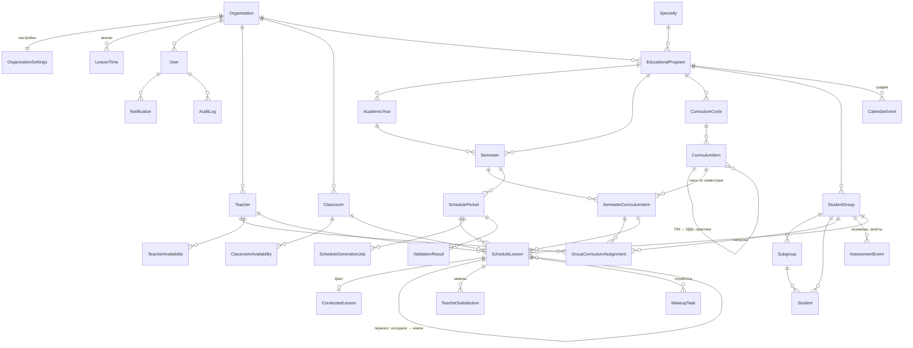

# 2. Схема базы данных

PostgreSQL 16, схема описана в `apps/backend/prisma/schema.prisma` (30 моделей, 17 перечислений), изменения
применяются миграциями Prisma (`apps/backend/prisma/migrations`). В CI проверяется, что схема совпадает с миграциями.

## Диаграмма связей

## Сущности

### Организация и доступ

| Модель | Назначение | Ключевые поля |
| --- | --- | --- |
| `Organization` | Колледж | `name`, `shortName`, `timezone` |
| `OrganizationSettings` | Правила расписания | `academicHoursPerLesson` (2), `lessonsPerDay`, `maxGroupLessonsPerDay`, `maxSameDisciplinePerDay/Week`, `lateLessonNumber`, `workingDays`, лимиты окон и экзаменов, `scheduleConsultations`, `solverTimeLimitSeconds`, `solverWeightsJson` |
| `LessonTime` | Расписание звонков | `lessonNumber`, `startTime`, `endTime` |
| `User` | Учётная запись | `email`, `passwordHash`, `role`, `teacherId` (для преподавателя), `studentGroupId` (для студента), `refreshTokenHash` |
| `AuditLog` | Журнал изменений | `action`, `entityType`, `entityId`, `oldDataJson`, `newDataJson` |
| `Notification` | Уведомления | `type`, `title`, `message`, `scheduleLessonId`, `isRead` |

### Учебный план

| Модель | Назначение | Ключевые поля |
| --- | --- | --- |
| `Specialty` | Специальность ФГОС СПО | `code` (09.02.07), `name`, `qualification`, `durationMonths` |
| `EducationalProgram` | Учебный план набора | `admissionYear`, `studyForm`, `durationMonths`, `totalSemesters`, `status` |
| `AcademicYear` | Учебный год (курс) | `title`, `courseNumber`, `startDate`, `endDate` |
| `Semester` | Семестр | `number`, `courseNumber`, даты, недели теории/аттестации/практики/каникул |
| `CurriculumCycle` | Цикл (ОГСЭ, ЕН, ОП, ПМ…) | `code`, `name`, `sortOrder` |
| `CurriculumItem` | Дисциплина, ПМ, МДК, практика, ГИА | `code`, `name`, `itemType`, `parentItemId` (иерархия ПМ → МДК), `isDifficult` |
| `SemesterCurriculumItem` | Часы элемента в семестре | `lectureHours`, `practicalHours`, `laboratoryHours`, `consultationHours`, `selfStudyHours`, `assessmentHours`, `practiceHours`, рассчитанные `planned*Lessons`, `controlForm`, `practiceAtCollege`, `scheduleConsultations`, допустимые типы аудиторий по видам занятий |

### Контингент, кадры, аудитории

| Модель | Назначение | Ключевые поля |
| --- | --- | --- |
| `StudentGroup` | Учебная группа | `code`, `courseNumber`, `currentSemesterNumber`, `studentCount`, `subgroupCount` |
| `Subgroup` | Подгруппа | `number`, `name`, `studentCount` |
| `Student` | Студент | `fullName`, `recordBookNumber`, `subgroupId` |
| `Teacher` | Преподаватель | `department`, `maxWeeklyLessons`, `maxDailyLessons`, `preferredStartLesson/EndLesson` |
| `TeacherAvailability` | Недоступность и предпочтения | `weekday`, `lessonNumber`, `isAvailable`, `preferenceWeight` (−10…10), `reason` |
| `Classroom` | Аудитория | `code`, `building`, `capacity`, `classroomType`, `equipmentJson` |
| `ClassroomAvailability` | Недоступность аудитории | `weekday`, `lessonNumber`, `isAvailable` |
| `GroupCurriculumAssignment` | Нагрузка: кто и как ведёт | `lessonType` (null — все виды), `subgroupNumber` (null — вся группа), `teacherId`, `weeklyLessonTarget`, `priority`, `preferredClassroomId`, `classroomTypes`, `streamKey` (поток), `allowHoursExcess` |

### Календарный график

| Модель | Назначение | Ключевые поля |
| --- | --- | --- |
| `CalendarEvent` | Период графика | `eventType` (теория, аттестация, каникулы, практики, ГИА, праздник…), даты, область действия (`educationalProgramId`, `courseNumber`, `studentGroupId`, `teacherId`; без них — весь колледж), `blocksSchedule` |
| `AssessmentEvent` | Экзамен, зачёт | `controlForm`, `date`, `lessonNumber`, `teacherId`, `classroomId` |

### Расписание и факт

| Модель | Назначение | Ключевые поля |
| --- | --- | --- |
| `SchedulePeriod` | Период расписания (неделя, месяц, семестр) | даты, `status` (черновик → сгенерировано → опубликовано → архив), `publishedAt` |
| `ScheduleLesson` | Занятие | `date`, `lessonNumber`, время, группа, `subgroupNumber`, дисциплина семестра, `lessonType`, преподаватель, аудитория, `status`, `academicHours` (2 или 1 для неполной пары), `originalLessonId` (перенос), `streamKey`, `isManual`, `isLocked`, `generationJobId` |
| `ConductedLesson` | Отметка о проведении | `status` (проведено, отменено, перенесено, замена), `actualHours`, `actualTeacherId`, `actualClassroomId`, `cancellationReason`, `replacementLessonId` |
| `TeacherSubstitution` | Замена преподавателя | исходный и заменяющий преподаватель, причина, кто утвердил |
| `MakeupTask` | «Требуется отработка» | исходное занятие, группа, подгруппа, дисциплина, вид, часы, статус, занятие-отработка |
| `ScheduleGenerationJob` | Задание генерации | `status`, `mode`, параметры, прогресс, решатель, результат (предпросмотр), статистика, ошибки |
| `ValidationResult` | Результат проверки | `severity` (ошибка, предупреждение, информация), `validationType`, объект, сообщение, детали |

## Правила целостности

- Уникальность: код специальности + квалификация; код элемента в учебном плане; номер семестра в плане; шифр группы;
  номер подгруппы в группе; номер аудитории в организации; строка часов «элемент × семестр»; слот доступности.
- Каскадное удаление подчинённых данных плана и расписания; ссылки на преподавателя и аудиторию в занятиях при
  удалении обнуляются (`SetNull`), но сервисы запрещают удаление, если есть занятия, — предлагается деактивация.
- Индексы по датам и сущностям занятий (`date + lessonNumber`, группа/преподаватель/аудитория + дата) обеспечивают
  быструю проверку конфликтов.
- Даты хранятся как `DATE` (без времени), время пар — строками `HH:MM` по сетке звонков.
